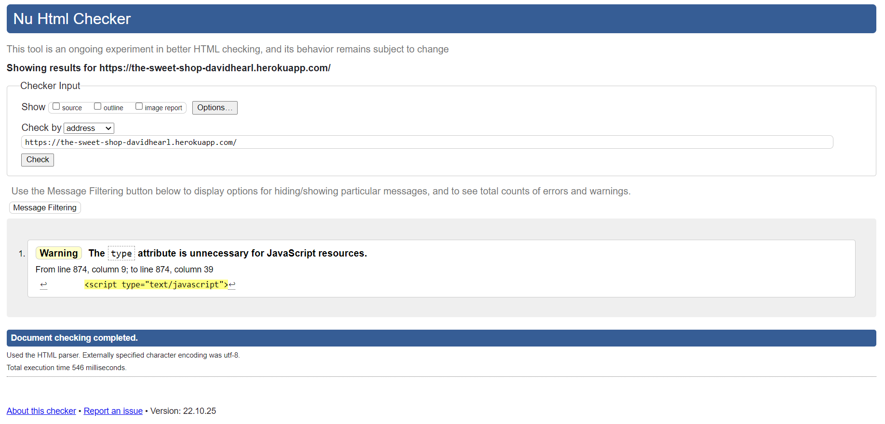

# Testing

## Table of Contents

- Google's Lighthouse Performance
- Accessability Validation
- HTML Validation
- CSS Validation
- JS Validation
- PEP8 Validation
- Manual Testing
- Automated Testing
- Responsive Testing

## HTML Validation - https://validator.w3.org/
---

## CSS Validation - https://jigsaw.w3.org/css-validator/validator.html.en
---

## PEP 8 Validation - http://pep8online.com/
---

#### Checkout
- Admin.py

- Forms.py

- Models.py

- Urls.py

- Views.py

- Webhook handler.py
- There seems to be an issue with the webhook handler where it is causing errors on the tab indentation. I have reformatted the document as indent with tabs instead of spaces. Since the warnings do not effect the site at all I have elected to ignore the issue .

- Webhook.py
- In the webhook.py file an error is causes due to line length. The readability would be greatly reduced if I was to ammend this issue and Django allows an extension to 99 characters in certain circumstances. Therefore it is best to overlook this issue

#### Favourites
- Models.py

- Urls.py

- Views.py

#### Home

- Urls.py

- Views.py

#### Products

- admin.py

- forms.py

- models.py

- urls.py

- views.py

- widgets.py

#### Profiles

- forms.py

- models.py

- urls.py

- views.py

#### Shopping Bag

- contexts.py

- urls.py

- views.py

## Manual Testing

## Automated Testing

Automated Unit Testing werer carried out using Django's inbuilt testing tools. Tools were written to cover a large variety of the site. Below Are instructions on how to run the tests, with an overview of the 29 tests.

Before testing can begin the database needs to be disabled. To do this we need to go into the env.py file and comment out the "DATABASE_URL" value which should be mapped to our postgres database. Once this is done, you can run the tests with the following command.

Terminal Command : python3 manage.py test

It is important to note the file structure required for the tests. Within each application there needs to be a folder called "test", as an example the checkout folder stucture is as follows : sweet_shop/checkout/test/*test_xxx_xxx.py*. Within the test file there also needs to be a blank dunder init file.

### Checkout Appication
    - Forms
        - test_full_name_required                       [Passed]
        - test_email_required                           [Passed]
        - test_phone_number_required                    [Passed]
        - test_street_address_required                  [Passed]
        - test_town_or_city_required                    [Passed]
        - test_country_is_required                      [Passed]
    - Models
        - test_order_string
    - Urls
        - test_response_of_checkout_page                [Passed]
        - test_response_of_checkout_success_page        [Passed]
        - test_response_of_cache_checkout_data          [Passed]
    - Views
        - test_empty_bag_error

### Favourite Appication
    - Models
        - test_favourites_string_method
    - Views
        - test_get_product_favourites_page
        - test_add_product_to_favourites
        - test_remove_product_from_favourites

### Home Appication
### Products Appication
### Profiles Appication
### Shopping Bag Appication

## Responsive Testing