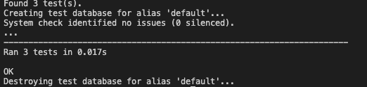

# Testing

## Table of Contents

- Google's Lighthouse Performance
- Accessability Validation
- HTML Validation
- CSS Validation
- JS Validation
- PEP8 Validation
- Manual Testing
- Automated Testing
- Responsive Testing

## HTML Validation - https://validator.w3.org/
---

### Home
- Home Page
- Sign Up Page
- Sign In Page
- Logout Page

### Products
- Products Page
- Product Details
- Update Product

### Favourites
- Favourites Page

### Shopping Bag 
- Shopping bag Page

### Checkout
- Checkout Summary Page
- Checkout Page
- Checkout Success Page=

## CSS Validation - https://jigsaw.w3.org/css-validator/validator.html.en
---

## PEP 8 Validation - http://pep8online.com/
---

#### Checkout
- Admin.py

- Forms.py

- Models.py

- Urls.py

- Views.py

- Webhook handler.py
- There seems to be an issue with the webhook handler where it is causing errors on the tab indentation. I have reformatted the document as indent with tabs instead of spaces. Since the warnings do not effect the site at all I have elected to ignore the issue .

- Webhook.py
- In the webhook.py file an error is causes due to line length. The readability would be greatly reduced if I was to ammend this issue and Django allows an extension to 99 characters in certain circumstances. Therefore it is best to overlook this issue

#### Favourites
- Models.py

- Urls.py

- Views.py

#### Home

- Urls.py

- Views.py

#### Products

- admin.py

- forms.py

- models.py

- urls.py

- views.py

- widgets.py

#### Profiles

- forms.py

- models.py

- urls.py

- views.py

#### Shopping Bag

- contexts.py

- urls.py

- views.py

## Manual Testing

## Automated Testing

## Responsive Testing